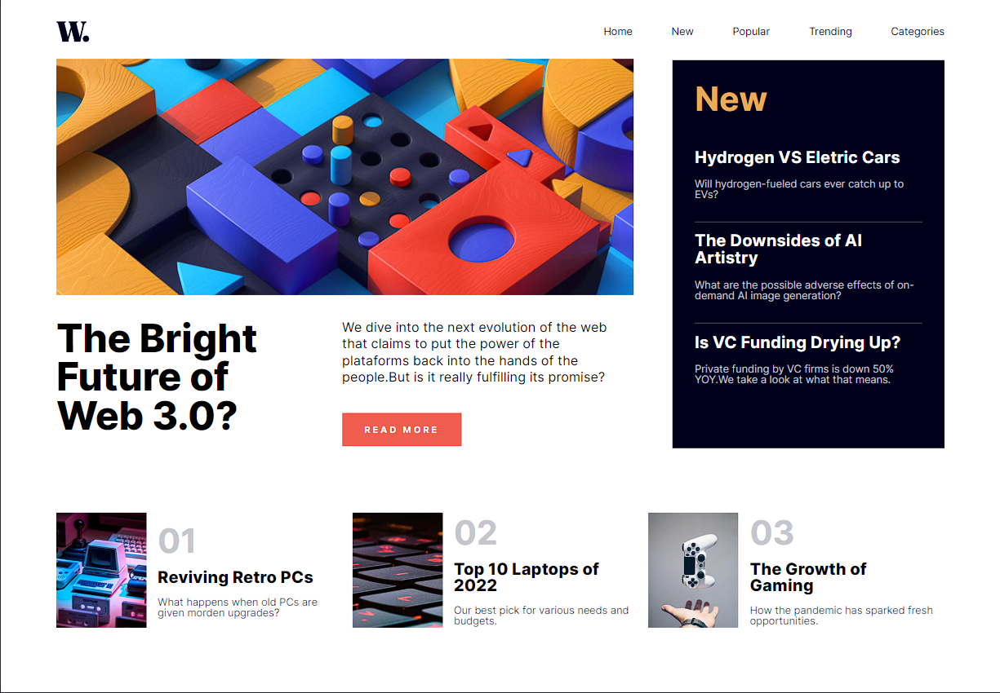
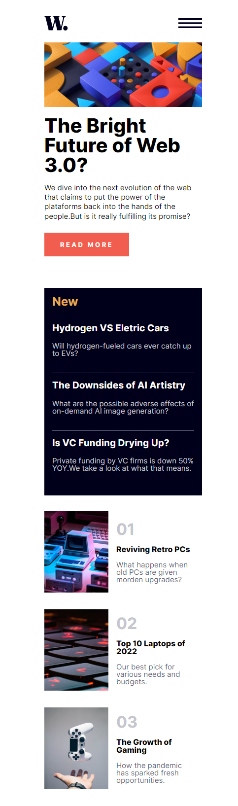

# Frontend Mentor - News homepage solution

This is a solution to the [News homepage challenge on Frontend Mentor](https://www.frontendmentor.io/challenges/news-homepage-H6SWTa1MFl). Frontend Mentor challenges help you improve your coding skills by building realistic projects. 

## Table of contents

  - [Overview](#overview)
  - [The challenge](#the-challenge)
  - [Screenshot](#screenshot)
  - [Links](#links)
  - [My process](#my-process)
  - [Built with](#built-with)
  - [Useful resources](#useful-resources)
  - [Author](#author)

## Overview

This is a project I made with the intention of learning and practicing the React.js library. It was created using ```create-react-app``` as it is a simple and small application.

### The challenge

Users should be able to:

- View the optimal layout for the interface depending on their device's screen size
- See hover and focus states for all interactive elements on the page
- **Bonus**: Toggle the mobile menu (requires some JavaScript)

### Screenshot




### Links

- Solution URL: [Add solution URL here](https://github.com/reginaguermandi/homepage)

- Live Site URL: [Add live site URL here](https://your-live-site-url.com)

## My process

First I did a little research on how to start this project and I understood that for a small application another framework would not be necessary, I chose to use only CSS for customization because my focus would be to understand the structure of the files and separate the components as clearly as possible.

To make the navigation links and the list of articles, I chose to use the ```map``` method, with the articles being imported from a data.js file.
In terms of responsiveness, I first chose to make it mobile and then adapt it to other screens, I had a little difficulty with screens larger than 1440px because it broke the layout, but after researching I found the solution using ```max-width``` and it worked fine.

Obviously there's a lot to be learned, but I was satisfied with this first attempt at React.js and will continue to study further.

### Built with

- Semantic HTML5 markup
- CSS custom properties
- Flexbox
- CSS Grid
- Mobile-first workflow
- [React](https://reactjs.org/) - JS library


### Useful resources

- [React srcset for Responsive Images](https://crystallize.com/blog/react-srcset-for-responsive-images)

## Author

- Frontend Mentor - [@reginaguermandi](https://www.frontendmentor.io/profile/reginaguermandi)
- Linkedin- [in/reginaguermandi/](https://www.linkedin.com/in/reginaguermandi/)

## Available Scripts

In the project directory, you can run:

### `npm start`

Runs the app in the development mode.\
Open [http://localhost:3000](http://localhost:3000) to view it in your browser.

The page will reload when you make changes.\
You may also see any lint errors in the console.

### `npm test`

Launches the test runner in the interactive watch mode.\
See the section about [running tests](https://facebook.github.io/create-react-app/docs/running-tests) for more information.

### `npm run build`

Builds the app for production to the `build` folder.\
It correctly bundles React in production mode and optimizes the build for the best performance.

The build is minified and the filenames include the hashes.\
Your app is ready to be deployed!

See the section about [deployment](https://facebook.github.io/create-react-app/docs/deployment) for more information.
